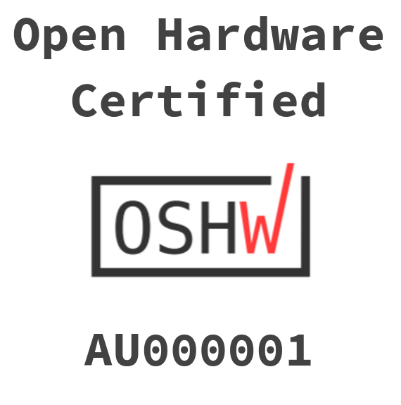

# Tomu @ 33C3

There are ~100 @ 33C3. Submit a pull request to get one!

## Hack Session

The RIAT Crypto Lab will be running a Tomu "Hack" session at 33C3 tomorrow at
2:00pm (2016/12/30 14:00).

### 2016/12/30 14:00

The aim will to get people set up with the tool chain, loading the blinking
firmware and other similar things. There will also be a chance to get Tomu
boards (and maybe even have a few Tomu+ boards).

 * [Hacking Session](https://events.ccc.de/congress/2016/wiki/Session:Hacking_Tomu_and_2FA)
 * [Meet RIAT Crypto Lab](https://events.ccc.de/congress/2016/wiki/Assembly:RIAT_Crypto_Lab)

 
 

# [Tomu, I'm](https://tomu.im)

[I'm Tomu](https://tomu.im) a tiny ARM microprocessor which fits in your USB
port. I have two buttons and two LEDs!

I'm fully open source, have a BOM of ~$10 (in individual quantities) and am
constructable by hobbyists! Designed for 2-factor authentication or anything
else you can think of.


<iframe style="min-height: 400px;" src="https://docs.google.com/presentation/d/1XT5oWsYzFATEelErZnxvSWVnVSFUm2gO2fWi31SKbWI/embed?start=true&loop=true&delayms=3000" frameborder="0" width="100%" allowfullscreen="true" mozallowfullscreen="true" webkitallowfullscreen="true"></iframe>
 
 
<iframe  width="560" height="315" src="https://www.youtube.com/embed/36zcE_C0K2k" frameborder="0" allowfullscreen></iframe>
 
 


  

# Getting Started!

## FIXME! Someone should add something here....

 * All Tomu boards have been loaded with USB bootloader.
 * To get the USB bootloader to come up, you must connect C pin to VCC.
 * [Random Starting instructions here](https://groups.google.com/forum/#!topic/tomu-discuss/r-LS0C7hjko)

  

# Help us!

These are currently the top items which need to be done related to the Tomu. If
you help out, [@mithro](https://github.com/mithro) will probably send you a
Tomu device!

### Creating (or porting) a FOSS USB stack to EFM32HG

To make it easy for people to develop new applications of the Tomu, we need a
good USB stack which is compatible with the EFM32HG.

There are a couple of possible options;

 * [Porting LUFA](https://github.com/im-tomu/tomu-samples/issues/2) - Someone
   seems to have already started the EFM32 series, just not the EFM32HG.
 * [Port ChibiOS](https://github.com/im-tomu/tomu-samples/issues/11)
 * Other options?

### Creating (or porting) U2F / FIDO compatible firmware

 * [More Info](https://github.com/im-tomu/tomu-samples/issues/3)

The ultimate goal of the Tomu is to be used as a 2nd factor authentication
device. For this to work [someone needs to write firmware compatible if the FIDO
protocol](https://github.com/im-tomu/tomu-samples/issues/3).

There are already a bunch of things which seem like it would make this easier like;
[micro-ecc](https://github.com/kmackay/micro-ecc),
[Nitrokey](https://github.com/Nitrokey),
[u2f-zero](https://github.com/conorpp/u2f-zero) and
[stm32-u2f](https://github.com/avivgr/stm32-u2f).

### QEmu Emulation of the EFM32HG

 * [Code Repo](https://github.com/im-tomu/qemu)

We would like to have good emulation of the features in the EFM32HG309
processor so that people can write software for the board without having to
have the hardware.

The biggest part of this is the emulation of the USB stack.

### Creation of Tomu bootloader programming rig

The EFM32HG come with a bootloader which doesn't work without an external
crystal. We thus need to replace the bootloader with a version that does. It
would be good to have a standard rig which allows programming of multiple Tomu
boards (a whole panel) at once.

  

# Contact

 * [Announcement mailing list](https://groups.google.com/forum/#!forum/tomu-announce/join) - Low traffic list for announcements.
 * [Discussion mailing list](https://groups.google.com/forum/#!forum/tomu-discuss/join) - List for discussing development / new features / etc.
 * [IRC Channel - irc://irc.freenode.net/#tomu](https://webchat.freenode.net/?channels=#tomu) - IRC channel for discussing anything related to the project.

  

# Tomu Hardware

Built out of a 3d printed part + 2 layer "thin" PCB (0.4mm, 0.6mm or 0.8mm
thick).

Both boards have;

 * 6mil traces
 * 6mil clearance
 * 0.3mm drill / 0.6mm vias

All Tomu boards have;

 * At least 2 different color LEDs
 * At least 2 touch buttons

## Tomu

 * **Status**: Hardware complete, simple flashing firmware working. Needs proper
   firmware.
 * [GitHub Repository](https://github.com/im-tomu/tomu-hardware)

### Specs

 * Uses a Silicon Labs Happy Gecko EFM32HG309
   - 25MHz ARM Cortex-M0+
   - 8kb^ RAM
   - 64kb^ Flash
   - USB 2.0

 * Literally 12 Parts
 * BOM ~$10 USD from Digikey (in individual quantities)

### Gerbers

 * [v0.2](https://github.com/im-tomu/tomu-hardware/tree/master/releases/v0.2/gerbers)

The important thing to note is that you need a PCB that is 0.8mm thickness **or
less**. The default thickness is normally 1.0mm and **1.0mm is too thick**.

These gerbers should be possible with the following manufacturers;

 * (Tested) [Hackvana](http://www.hackvana.com/store/)
 * (Undergoing testing) [DirtyPCB](http://dirtypcbs.com/store/pcbs)
 * (Undergoing testing) [Seeed Studio](https://www.seeedstudio.com/fusion_pcb.html)
 * (Yet to be ordered) [OHS Park - 2 Layer 2oz 0.8mm Service](http://docs.oshpark.com/services/two-layer-hhdc/)

## Tomu+

 * **Status**: First prototypes in construction.
 * [GitHub Repository](https://github.com/im-tomu/tomuplus-hardware)
 
### Specs

 * Uses a Freescale Semiconductor / NXP Kinetis KL27 (MKL27Z256VFM4)
   - 48MHz ARM Cortex-M0+
   - 32kb^ RAM
   - 256kb^ Flash
   - USB 2.0

 * Optional Atmel ATECC508A Hardware Crypto Chip
 * BOM ~$15 USD from Digikey (in individual quantities)

  

# License

The Tomu hardware is under your choice of;

 * the "Creative Commons Attribution-ShareAlike 4.0 International License"
   (CC BY-SA 4.0) full text of this license is included in the LICENSE file
   and a copy can also be found at
   http://creativecommons.org/licenses/by-sa/4.0/
 * the "TAPR Open Hardware License" full text of this license is included
   in the LICENSE file and a copy can also be found at
   http://www.tapr.org/OHL

Software for Tomu is under various licenses, please consult the license
included with the code.

