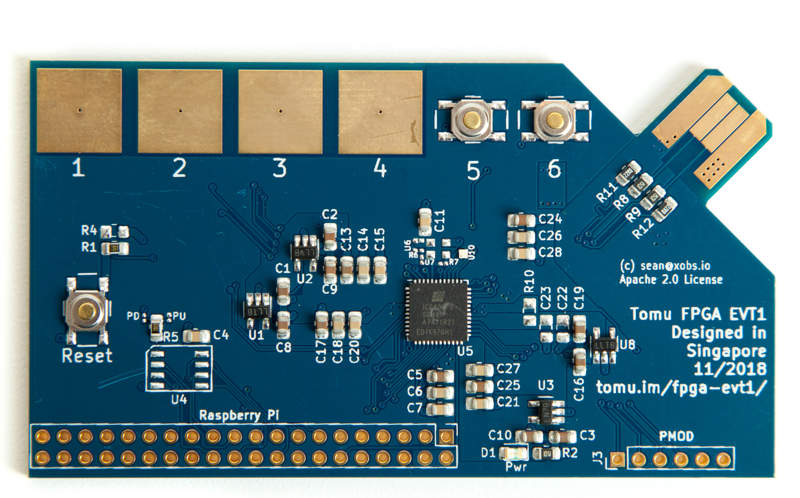

<style>
.container {
  max-width: initial;
}
</style>

# Fomu EVT2

This is a revision of the Fomu development PCB.  It is easy to produce, and has lots of debug pins, but obviously doesn't fit _inside_ your USB port.

This improves on many of the design errors with EVT1.  It also adds the following features:

* ESD protection (optional)
* More silkscreen indicators
* Alligator clip points for GND and power
* Easier to swap SPI from pullup to pulldown

## Component Checklist

|Subsystem        | Quick Test | In-Depth Test
|-----------------|------------|--------------
|1.2V Reg         | Pass
|2.5V Reg         | Pass
|3.3V Reg         | Pass 
|VCCPLL Filter    | Pass       | FAIL (ICE40 doesn't like regulator here)
|Xtal Oscillator  | Pass
|SPI Flash        | Pass (QPI) | FAIL (Identifier silk is swapped)
|USB Pullup       | 
|USB Pad Polarity |
|RGB LED          | Pass 
|Captouch Pads    |
|Capacitance      |
|Reset Button     | Pass
|User buttons     | Pass

## Engineering Change Orders

Changes need to be made when producing EVT2.  This is the list of changes to make:

### ECO001: SPI PU/PD identification silk is swapped

***Description:** SPI generally requires a pull on the chip select pin.  The ICE40 changes its behavior depending on whether it's a pullup or a pulldown.  Fomu EVT has both options.  The "PU/PD" indicator silk is correct, however R3 is labeled R13, and R13 is labeled R3.

**Action:** Swap R3 and R13 identifiers.

### ECO002: Add a second PMOD header

**Description:** There are four touch pads, and four pins in a PMOD header. It would be nice to have an additional PMOD header for people who don't want to use the touchpads.

**Action:** Add a second PMOD header near the captouch pads.

---

## Raspberry Pi Usage

You can communicate with Fomu using [fomu-flash](https://github.com/im-tomu/fomu-flash).

### Raspberry Pi GPIO pinouts

The `BCM` value here is the GPIO according to the Broadcom chip, and according to Linux.  You can access these pins through /sys/class/gpio/gpio[BCM]/ or through `gpio -g`.

|BCM | Header | Signal
|----|--------|--------
|17  | 11     | C_DONE
|27  | 13     | C_RESET
|24  | 18     | SPI_IO2/WP
|10  | 19     | SPI_MOSI
| 9  | 21     | SPI_MISO
|25  | 22     | SPI_IO3/HOLD
|11  | 23     | SPI_CLK
| 8  | 24     | SPI_CS

Usage examples:

```sh
# Put the SPI flash in "HOLD" mode, so it ignores us.
gpio -g mode 25 out
gpio -g write 25 0
```

```sh
# Enable SPI flash "WP" mode
gpio -g mode 24 out
gpio -g write 24 1
```

```sh
# Put FPGA into reset
gpio -g mode 27 out
gpio -g write 27 0
```

```sh
# Monitor the C_DONE pin
gpio -g mode 17 in
gpio -g read 17 # Goes 1 when programming is done
```


