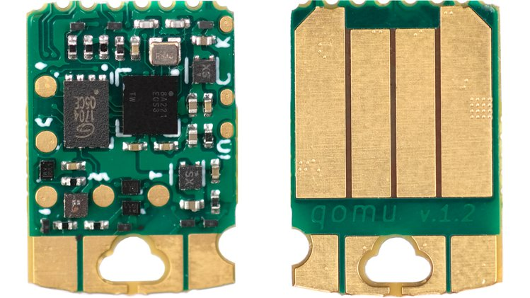

# Qomu, I'm

I'm Qomu, an Arm MCU + eFPGA SoC in your USB port!  I have an Arm Cortex M4F MCU with 512 kilobytes of RAM, and ~1K LUT4 FPGA logic cells for a soft USB core, offloading CPU-intensive functions from the Arm core, and even a couple of small RISC-V cores.  I have four contact pads that can easily be used to make two buttons.  And just like my siblings, I have an RGB LED, because everyone loves blinking an LED any color of the rainbow!

I'm going to be available shortly for [order now on Crowd Supply](https://www.crowdsupply.com/quicklogic/qomu).

# Repositories

* [Qomu Hardware](https://github.com/QuickLogic-Corp/qomu-dev-board)
* [Qomu QORC SDK](https://github.com/QuickLogic-Corp/qorc-sdk)
* [Qomu Zephyr OS](https://github.com/QuickLogic-Corp/zephyr)
* [Qomu Renode Support](https://renode.io/)
* [Qomu FPGA Toolchain](https://github.com/QuickLogic-Corp/quicklogic-fpga-toolchain)

# Contact

* [QuickLogic Forum](https://forum.quicklogic.com/ucp.php?mode=register) - Open Forum for discussing development / new features / etc.
* [QuickLogic GitHub](https://github.com/QuickLogic-Corp) - QuickLogic GitHub for getting software, specs, and posting issues.

# History

In June of 2020, QuickLogic joined the FOSS movement by announcing QuickLogic Open Reconfigurable Computing (QORC).  We are actively contributing the necessary architectural information on our FPGAs and eFPGA cores so that Open Source FPGA Tooling can enable all the features and capabilities of our devices for the Community.  See [QORC](https://www.quicklogic.com/qorc/)

# Specs

## Qomu Production (DVT) Board


