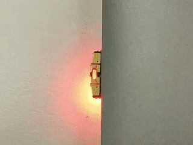

<style>
.container {
  max-width: initial;
}
</style>


[I'm Tomu](https://tomu.im/tomu.html), a tiny ARM microprocessor which fits in your USB port. I have two buttons and two LEDs!

I'm fully open source and am buildable by hobbyists! Designed for 2-factor authentication, USB experiments, or anything else you can think of.

I'm also available on [Crowd Supply](https://www.crowdsupply.com/sutajio-kosagi/tomu/), fully assembled and tested.

<hr><br><br>

# Getting Started!

Got a Tomu?  Great!  For a hyper-fast quickstart, check out the [Tomu Quickstart repo](https://github.com/im-tomu/tomu-quickstart/).  All you need is `make`, a compiler, and `dfu-util`.

More information on the Quickstart repo, including links to precompiled samples, is available at the [quickstart samples](/samples) page.

If you're building one from scratch, you'll need to get a case and a bootloader.  For more information, read on!

## Case

Because Tomu fits entirely inside your USB port, you need something to keep it from falling out.  Early Tomu prototypes were held in place using a business card folded over and wedged in the USB port, but newer releases have support for 3D printed cases.

If you have a 3D printer, [download the .stl file](https://github.com/im-tomu/tomu-hardware/tree/master/case) for the version of Tomu that you have.  The version number is printed on the bottom side with the big USB connections.  Depending on how thick your PCB is, you may need to adjust the FreeCAD file.

## Bootloader -- Toboot (DFU Bootloader)

The name of the DFU bootloader is [Toboot](https://github.com/im-tomu/tomu-bootloader).  DFU is a USB standard for updating firmware on a device.  The canonical program to use is `dfu-util`, which is in most major Linux distributions.  When Tomu is in Bootloader mode, it will flash red/green, and show up when you run `dfu-util -l`.



**Version 1.0 of Toboot will auto-run a program if one exists**.  That means that once you load the Sample program, Toboot will always run the sample program.  To get back into Toboot, you will need to connect both capacitive buttons when you apply power.  Tweezers are useful here.  A future version of Toboot will have a "developer mode" that will cause it to always boot into DFU mode.

To load a program, run `dfu-util -D [program].bin`.  Toboot will flash the new program onto your Tomu and reboot.  Don't worry if you flash the wrong file, or flash an invalid program -- Toboot will detect this and reboot into DFU mode if the file you flash fails to run.

<hr><br><br>

# Back Us!

Tomu is [crowdfunding on Crowd Supply](https://www.crowdsupply.com/sutajio-kosagi/tomu/)!

Fomu, the FPGA version of Tomu, is [also crowdfunding on Crowd Supply](https://www.crowdsupply.com/sutajio-kosagi/fomu/)!

<hr><br><br>

# U2F / FIDO Firmware

GNU Chopstx has been ported to Tomu, complete with U2F support.  That means you can use Tomu like any U2F token to add a second authentication factor when you log in.  Chrome and Firefox support U2F natively.

## Source

The U2F firmware source is located on Github at [gl-sergei/u2f-token](https://github.com/gl-sergei/u2f-token).

### Building

To build the U2F firmware, ensure you have an ARM compiler installed (e.g. `sudo apt install gcc-arm-none-eabi openssl`) as well as Python pip (e.g. `pip install --user --upgrade asn1crypto`), then run:

```
git clone https://github.com/gl-sergei/u2f-token.git
cd u2f-token
git submodule update --init
cd src
make TARGET=TOMU
```

### Loading onto Tomu

The build system produces an output file build/u2f.bin.  Upload this file to Tomu.

* If using the DFU bootloader, reboot into DFU mode and run `dfu-util -D build/u2f.bin`
* If using the legacy serial bootloader, type **u** and send the file using XMODEM

### Updating udev rules

On Linux-based systems you will need to update your entry in `/etc/udev/rules.d/10-tomu.rules` (or create it if you haven't already) to reflect the new product and vendor IDs so that you'll have permissions to the device.

```
ACTION=="add|change", KERNEL=="hidraw*", SUBSYSTEM=="hidraw", ATTRS{idVendor}=="0483", ATTRS{idProduct}=="cdab", TAG+="uaccess"
```

### Generating private keys on a host machine

During a firmware update, your U2F private key will be erased from the Tomu. This means you won't be able to use it to login into websites anymore.

This can be alleviated by [generating your private key on a host machine](https://github.com/im-tomu/chopstx/tree/efm32/u2f#injecting-private-key) and pushing them on your Tomu.

<hr><br><br>

## Presentations


<iframe style="min-height: 400px;" src="https://docs.google.com/presentation/d/1NV4QAr7nQg5OAjLGDzVBely9bvDAFhP1qIqw7IU5Wdk/embed?start=true&loop=true&delayms=3000" frameborder="0" width="100%" allowfullscreen="true" mozallowfullscreen="true" webkitallowfullscreen="true"></iframe>
<br>
<iframe  width="560" height="315" src="https://www.youtube.com/embed/36zcE_C0K2k" frameborder="0" allowfullscreen></iframe>


<hr><br><br>

## Help us!

These are currently the top items which need to be done related to the Tomu. If
you help out, [@mithro](https://github.com/mithro) will probably send you a
Tomu device!

### Creating (or porting) a FOSS USB stack to EFM32HG

To make it easy for people to develop new applications for the Tomu, we need a
good USB stack which is compatible with the EFM32HG.

There are a couple of possible options:

* [Porting LUFA](https://github.com/im-tomu/tomu-samples/issues/2) - Someone
  seems to have already started the EFM32 series, just not the EFM32HG.
* [Port ChibiOS](https://github.com/im-tomu/tomu-samples/issues/11)
* Other options?

### QEmu Emulation of the EFM32HG

* [Code Repo](https://github.com/im-tomu/qemu)

We would like to have good emulation of the features in the EFM32HG309
processor so that people can write software for the board without having to
have the hardware.

The biggest part of this is the emulation of the USB stack.

<hr><br><br>

# Contact

* [Announcement mailing list](https://groups.google.com/forum/#!forum/tomu-announce/join) - Low traffic list for announcements.
* [Discussion mailing list](https://groups.google.com/forum/#!forum/tomu-discuss/join) - List for discussing development / new features / etc.
* [IRC Channel - irc://irc.freenode.net/#tomu](https://webchat.freenode.net/?channels=#tomu) - IRC channel for discussing anything related to the project.

<hr><br><br>

# Tomu Hardware

Built out of a 3d printed part + 2 layer "thin" PCB (0.4mm, 0.6mm or 0.8mm
thick).

Boards have:

* 6mil traces
* 6mil clearance
* 0.3mm drill / 0.6mm vias

All Tomu boards have:

* At least 2 different color LEDs
* At least 2 touch buttons

## Tomu

* **Status**: Hardware complete, simple flashing firmware working. Needs proper
  firmware.
* [GitHub Repository](https://github.com/im-tomu/tomu-hardware)

### Specs

* Uses a Silicon Labs Happy Gecko EFM32HG309
  * 25MHz ARM Cortex-M0+
  * 8kb^ RAM
  * 64kb^ Flash
  * USB 2.0 FS and LS
* Literally 12 parts

### Gerbers

* [v0.2](https://github.com/im-tomu/tomu-hardware/tree/master/releases/v0.2/gerbers)

The important thing to note is that you need a PCB that is 0.8mm thickness **or
less**. The default thickness is normally 1.0mm and **1.0mm is too thick**.

These gerbers should be possible with the following manufacturers:

* (Tested) [DirtyPCB](http://dirtypcbs.com/store/pcbs)
* (Tested) [Seeed Studio](https://www.seeedstudio.com/fusion_pcb.html)
* (Tested) [OSH Park - 2 Layer 2oz 0.8mm Service](http://docs.oshpark.com/services/two-layer-hhdc/)

## License

The Tomu hardware is under your choice of:

* the "Creative Commons Attribution-ShareAlike 4.0 International License"
   (CC BY-SA 4.0) full text of this license is included in the LICENSE file
   and a copy can also be found at
   [http://creativecommons.org/licenses/by-sa/4.0/](http://creativecommons.org/licenses/by-sa/4.0/)
* the "TAPR Open Hardware License" full text of this license is included
   in the LICENSE file and a copy can also be found at
   [http://www.tapr.org/OHL](http://www.tapr.org/OHL)

Software for Tomu is under various licenses, please consult the license
included with the code.


